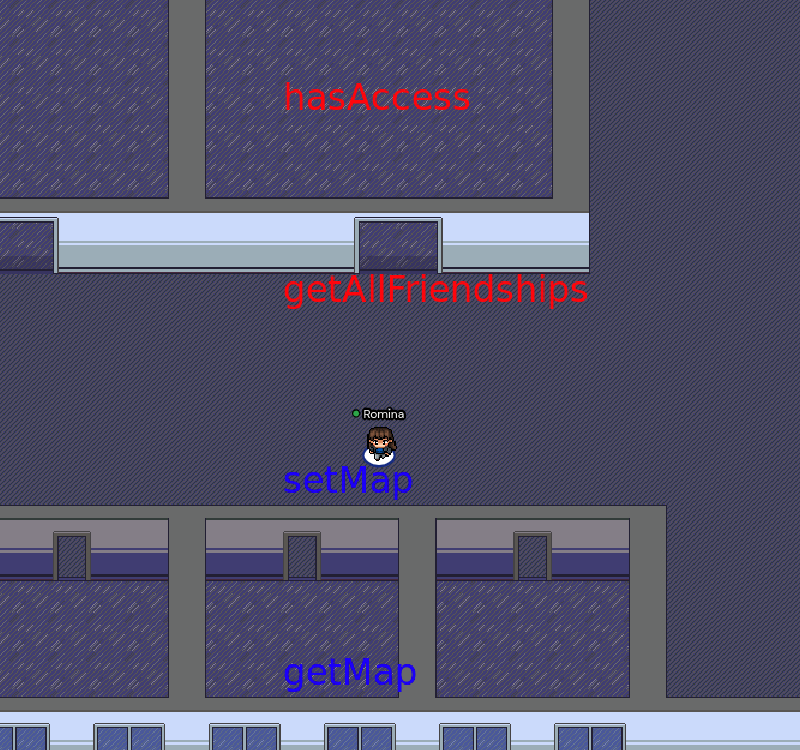

# xs-gather-sdk

A small, no-nonsense Gather.town SDK.



## What is this
A tiny SDK to prototype ideas with the Gather.town APIs while we wait for their Web Sockets APIs. 

## Can I launch my startup with this!?

No. I made this for a toy project I am having fun with. 

You can read about how I used the tiny SDK, here https://rowasc.com/experiments/funemployment-log-1-gather-town/ . 


# Notes on using this SDK

- Install it with `npm install rowasc/xs-gather-sdk --save`
- You will need to get your GATHER_X_X config data into the project. I'm using dotenv, but it's not required to do so.
- Since their official APIs may change, you may need to check https://www.notion.so/EXTERNAL-Gather-API-3bbf6c59325f40aca7ef5ce14c677444 for any changes.
- Get your API key from https://gather.town/apiKeys

## Required configuration
The configuration is needed in your project. It's used to enable the SDK to connect to Gather.town

```dotenv
GATHER_ROOM_ID="room id, for example something28282\yourspace"
GATHER_MAP_ID="your map id, for example door-by-100x100"
GATHER_API_KEY="your api key from gather"
# This BASE_URL can be their live or staging environment depending on need
GATHER_BASE_URL="https://staging.gather.town/"
# LOCAL_HOST_CALLBACK is only necessary if you plan to use callback URLs with Gather.town (not recommended, experimental)
LOCAL_HOST_CALLBACK="https://your-webserver/node"
```

## Show me some code

```typescript
// usage will vary depending on your setup
const dotenv = require('dotenv');
const config = dotenv.config({path: './.env'}).parsed;
// import the SDKinto your project
const gather = require('@rowasc/xs-gather-sdk');
// initialize the SDK
const gatherSdk = new gather.Api({
    gatherBaseUrl: config.GATHER_BASE_URL,
    gatherApiKey: config.GATHER_API_KEY,
    gatherSpaceId: config.GATHER_ROOM_ID,
    gatherMapId: config.GATHER_MAP_ID,
});
// getting all the objects in your Gather.town map
const getMap = () => {
    //get your gather.town map
    return gatherSdk.getMap()
        .then((result) => {
            // use setMap to change the map on the fly
            // result = the entire Gather payload
            return gatherSdk.setMap(result, makeMapObjects(result));
        })
        .then(result => {
            console.log("Your map has been edited, and it's ready now");
            console.log(result);
        })
        .catch(err => {
            console.error("Your map edit failed");
            console.error(err);
        });
}
// Changing a field in your Gather map objects
const makeMapObjects = (mapFromGather) => {
    return mapFromGather.data.objects.map(mapObject => {
        // Switch the "highlighted" and "normal" map object styles, for fun?
        let normal = mapObject.normal; 
        mapObject.normal = mapObject.highlighted;
        mapObject.highlighted = normal;
        return mapObject;
    });
}
// add to your map (keep in mind you need to send the map objects only, not the entire payload from the API)
const addToMap = (objects) =>  {
    gatherSdk.updateMap(objects)
        .then(result => {
            console.log("Your map is ready now");
            console.log(result);
        })
        .catch(err => {
            console.error("Your map edit failed");
            console.error(err);
        });
}
```
## What else can I do? 
- You can the type definitions to avoid having to guess the object type ids

```typescript
    const types =  require('@rowasc/xs-gather-sdk/dist/objectTypes').default;
    const videoTypeID = types('video').id;
```

- You can use the endpoint definitions provided as a shortcut to create your own methods

```typescript
    const endpoints =  require('@rowasc/xs-gather-sdk/dist/endpoints').default;
    const getMapEndpot = endpoints.getMap;
```
